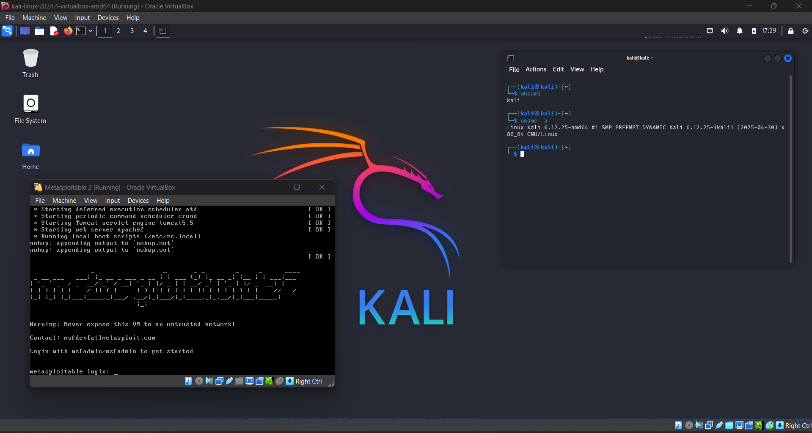
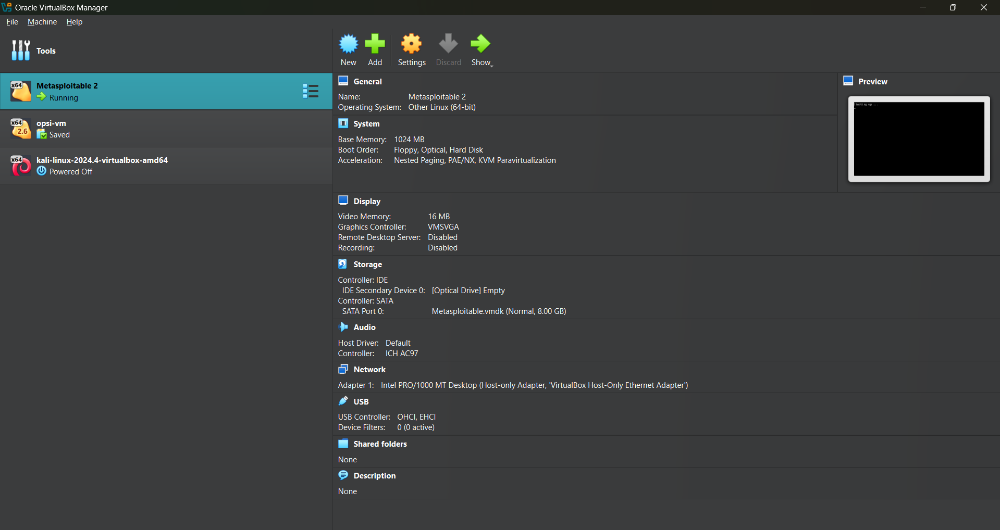
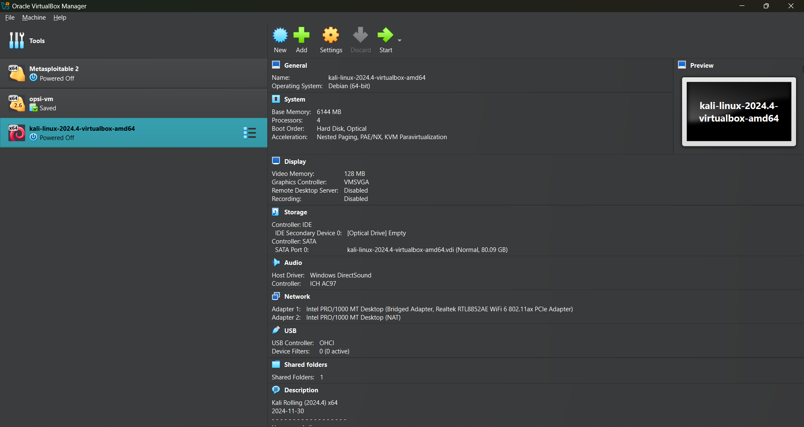

# Cybersecurity Lab  

This is my personal **Cybersecurity Lab**, where I explore offensive security concepts, penetration testing tools, and practice real-world attack simulations in a safe environment.  

---

## 🔹 Lab in Action  
A snapshot of the lab while running attacks, testing defenses, and analyzing network traffic.  

  

---

## 🔹 Metasploitable Setup  
A vulnerable Linux machine used for practicing exploitation techniques.  

  

---

## 🔹 Kali Linux Setup  
My primary penetration testing environment with pre-installed tools for ethical hacking.  

  

---

🚀 *This lab is designed for continuous learning and hands-on cybersecurity practice.*  
